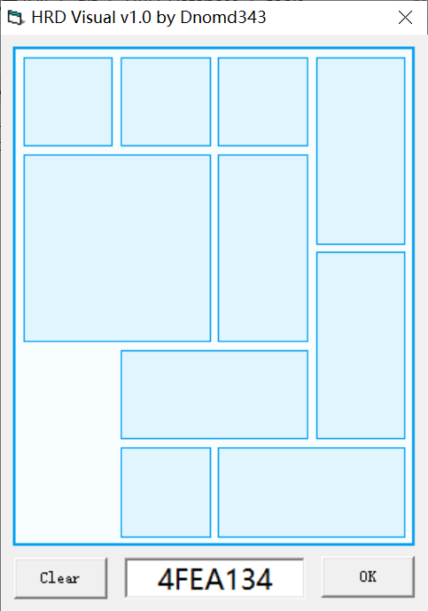

# HRD_Database Project

华容道数据库计划

## 项目简述

这是关于华容道性质的研究项目，目标是找到所有华容道布局并分析它们之间的关联，同时取得各方面的参数，并将收集到的资料建成数据库加以整理。

经典华容道游戏很难在数学上建模，也无法在数学证明上得到其具体性质；研究它的统计规律只能使用计算机进行穷举，遍历所有可能的布局，分别算出它们的各种数据，最后再进行整合统计。

因此，这个项目将通过穷举的方式来得到全部布局的详细信息并录入数据库进行分类整理，再而进行统计分析。

## 文档目录

+ [华容道严格定义](./docs/klotski.md)

+ [华容道编码原理](./docs/klotski_code.md)

+ [engine的使用](./docs/usage.md)

+ [函数库的调用](./docs/demo.md)

+ [群的数量统计](./docs/group_num.md)

+ [群包含的元素数量统计](./docs/group_size.md)

+ [64种分类的元素数量](./docs/jiang_bing_count.md)

+ [203种分类的元素数量](./docs/style_count.md)

## 数据库下载

### 完整数据库

**表结构**

+ main(id, code, is_mirror, jiang_num, bing_num, style_num, group_num, group_index)

+ farthest(id, farthest_step, farthest_num)

+ solution(id, min_solution_step, min_solution_num, solution_num)

**下载地址**

+ [腾讯微云](https://share.weiyun.com/5nj2lci4)

+ [百度网盘](https://pan.baidu.com/s/1mhDZPyIekzAv2s8Nd1g8_A)（提取码：d343）

+ [Github Release](https://github.com/dnomd343/HRD_Database/releases/download/v1.1/HRD_Database.7z)

**文件校验码**

> HRD_Database.7z  
> MD5: C2233DA977CD153F5E075F49077A2AC1

> HRD_Database.sql  
> MD5: 4D5E3FE372DFFFB39DA05BB7533840C6

### 标准布局数据库

**表结构**

+ main(id, short_code, code, style_num, group_num)

+ group_data(id, group_id, group_size)

+ farthest(id, farthest_step, farthest_num, farthest_case)

+ min_solution(id, min_solution_step, min_solution_num, min_solution_case)

+ solution(id, solution_num, solution_case)

**MySQL版本下载地址**

+ [腾讯微云](https://share.weiyun.com/kDNIRURH)

+ [Github Release](https://github.com/dnomd343/HRD_Database/releases/download/v1.1/HRD_Database_standard.7z)

**SQLite版本下载地址**

+ [腾讯微云](https://share.weiyun.com/WvNixqpY)

+ [Github Release](https://github.com/dnomd343/HRD_Database/releases/download/v1.1/HRD_Database_standard-sqlite.7z)

**文件校验码**

> HRD_Database_standard.7z  
> 4AB1F5F58D8EE2007AD6AAAF3E983AA7

> HRD_Database_standard.sql  
> F61E62BEF15C8D583BEC6D2587E9285C

> HRD_Database_standard-sqlite.7z  
> F1ADF546480777585F5A7563200414E0

> HRD_Database_standard.db  
> CBC5E5E9471C0EFD3AF341FFE98468DA

## 数据库的使用

如果你的计算机有MySQL环境，请以root身份登录后执行以下命令，资料将会导入到`hrd`数据库中

> DROP DATABASE IF EXISTS hrd;  
> CREATE DATABASE hrd;  
> USE hrd;  
> SOURCE \~/HRD_Database.sql;

如果你的计算机不方便安装MySQL服务，你可以选择使用以下信息登录云端数据库

> IP: 47.107.149.138  
> 端口: 34326  
> 用户名: hrd  
> 密码: hrd_db

+ 命令行环境下可安装`mysql-client`，使用以下命令登录

> mysql -h 47.107.149.138 -P34326 -uhrd -phrd_db

+ 需要图形化界面可安装`Navicat`，按上方信息登录即可

> 可以在这里得到免费版本的[Navicat](https://www.ghpym.com/navicat.html)

## 布署云端数据库

服务器必须有公网IP，安装MySQL服务后导入数据库

### 用户权限管理常用命令

+ 创建用户
> create user hrd identified by 'hrd_db';

+ 授予select权限
> grant select on hrd.* to hrd;

+ 收回select权限
> revoke select on hrd.* from hrd;

+ 查看用户拥有的权限
> show grants for hrd;

+ 查看用户与对应主机
> use mysql;  
> select host, user from user;

+ 删除用户
> drop user hrd;

## 如何运行这个项目

环境要求：c++编译工具，MySQL服务

build文件夹是计算并建立数据库的工作目录，里面的脚本均为Linux下使用；如果你是Windows环境，请安装[Git](https://git-scm.com/download/win)，然后在`Git Bash`工具运行中sh脚本；由于计算时间较长，建议在`screen`工具的虚拟窗口中运行。

1. 执行init.sh
这一步会进行引擎编译并计算得到全部布局及其分类，还会生成所有群的种子编码；它会得到./release/main.csv ./release/All_Case.txt ./seed/\*这些文件.

2. 分别执行cal_sh下的脚本(共64个计算部分)
由于总计算量较大，这里分为多个部分进行运算，每个脚本运行完成后会生成对应的_OK文件进行标记，计算结果会存放在../farthest与../solution文件夹下。
这里是[farthest](./docs/farthest_checksum.md)与[solution](./docs/solution_checksum.md)的哈希校验值，可以用于校验计算过程是否出错。

3. 执行release.sh
它会将farthest和solution文件夹下全部csv文档分别进行合并，得到./release/farthest.csv与./release/solution.csv这两个文件。
执行下一步之前，请先确认./release/下的文件MD5：

> All_Case.txt  EEB931800E1B6EB10D46DB4DD6A1561F

> main.csv      4B99D2AD0B919CDE2D0FDE6F7010E698

> farthest.csv  ED06FF2FE14E862BCD5F357408959BE8

> solution.csv  E05A98D2391CCFB058F62BDFEAAB1D09

4. 执行load.sql
它用于将csv文档导入MySQL数据库，请先确认以下内容：

  + 确认你的计算机有可用的MySQL服务
  + 确认你的MySQL允许导入外部文件
  + 如果你的项目文件夹不在\~/(用户目录)下，请手动编辑sql文件修改路径

  上述步骤完成后使用以下命令导入

> mysql -u root -p < \~/HRD_Database/build/load.sql

5. 如果以上步骤均无问题，则计算结果已成功储存在MySQL的`hrd`数据库中

## 项目设计

在搜索全部可能布局的问题上，纯粹的数学计算在这里毫无用武之地：不同的棋子有不同的排列方式，根本无法进行可行的排列组合计算；因此，搜索过程也只能暴力穷举，将棋子的全排列逐个验证，剔除无效的排列后将得到全部合法的布局。

为了完善地进行统计，有必要先定义了华容道的布局规则，移动规则及各种延伸概念，这里给出了一套完整的[严格定义](./docs/klotski.md)，此后的一切计算和统计将会在这个框架下进行。

经过统计，符合定义的华容道布局共有29334498种，这个数量级确实超出了个人的直观感受，但多次验证都证明这个数据是正确的；另一方面，千万级别的数据量也会对计算过程造成不小的挑战，甚至连数据库的大小都可能超出预期。

此前，大部分华容道的编程都是为了得到最少步解法，然而仅这一个数据对研究远远不够；目前选定了以下几个数据作为主要统计目标：

+ 解的最少步数

+ 最少步解的个数

+ 所有解的个数

+ 最远步数

+ 最远布局的个数

+ 衍生布局的个数

另一方面就是布局之间的关联，定义中给出了`群`的概念，它是一个封闭的集合，内部任何布局无论如何移动，其结果仍然会落在集合中，也即全部情况组合成了多个孤立的群。

综上，要统计的数据主要是：

1. 全部群的具体信息；

2. 全部布局各自的数据；

## 计算引擎

计算引擎使用c++编写，负责全部计算工作，同时，它也可以用于最短路径/最远布局/解的个数等其他方面的运算。

源码编译后是命令行程序，需输入指定命令进行运算工作，具体[使用方法](./docs/usage.md)将在这篇文档中阐述。

引擎封装了多个类实现不同功能，如果你有其他需求可以直接调用它的封装函数实现，这是它库函数的[使用演示](./docs/demo.md)。

## 计算时间问题

在华容道算法上，鉴于其数学复杂性，我们可选的也只能是无方向性的暴力搜索；绝大多数相关的程序也都使用了BFS方式进行搜索，通过哈希索引或者树结构优化计算速度，在计算过程中，单纯求解一般会经过约1000 \~ 100000个中间布局，得到结果后进行回溯；整个计算流程耗费的时间不等，对于常见的横刀立马布局，网络上流传的算法计算时间普遍在50ms \~ 800ms，个别优化较好的能下探到20ms附近；但即使做到这个速度，在千万级数据量面前都是相形见绌，计算时间和费用都是问题。

以上的讨论只是针对计算最少步数的，而现在要统计的还有其他数据，特别是最远布局，得到这个数据的计算量一般是单纯求解的数倍，这些都会严重拖慢计算进度。

为了在个人可行的范围内得到统计结果，只能尽可能地提升算力与优化算法。考虑到现在要做的是计算全部情况，而不是计算单个布局，可以通过转变计算方式来加快速度；这个方法的提升在于借助了群的性质，每次只针对一个群做运算：在华容道求解的算法中，耗时最大的就是寻找下一步和剪枝，而如果计算局限在一个群中，我们可以通过构建它们之间的关系网（即定义中的网模型），通过指针免除掉寻找下一步的问题，进而将找到的节点内存地址加入线性表中并进行标记，省去了剪枝的过程，通过这样子的计算速率可以大大提高。

### 现阶段的大致测速如下

> 全部内容均在阿里云c6计算型服务器（ecs.c6.large）上完成
> Intel Xeon(Cascade Lake) Platinum 8269CY，主频2.5GHz，睿频3.2GHz
> Ubuntu 18.04，双核4GB

+ 横刀立马(1A9BF0C09)求解：14.29毫秒（1000次14.29秒）

+ 五将逼宫(55ADF0C00)求解：4.42毫秒（1000次4.42秒）

+ 峰回路转(4FEA13400)求解：27.84毫秒（1000次27.84秒）

+ 横刀立马(1A9BF0C00)完整分析：28.10毫秒（1000次28.10秒）

+ 峰回路转(4FEA13400)完整分析：102.67毫秒（1000次102.67秒）

+ 分别对横刀立马(1A9BF0C00)的25955个衍生布局进行完整分析：33秒

+ 分别对峰回路转(4FEA13400)的81340个衍生布局进行完整分析：6分钟46秒

+ 找到所有合法布局并计算具体分类：27分钟14秒

## 编码

为了方便研究，每个华容道布局都有一个唯一的编码，它是一个九位长度的十六进制数，且编码和布局之间是一一对应的关系。

在设计上，编码亦可通过口算直接摆出布局样式，也可反过来根据布局算出编码，整个过程可以不需要借助计算机计算，稍微理解进制的都可以轻松做到。

考虑到大多数情况下，编码最后都会补0到九位，因此规定了编码后方的0可以省略；如横刀立马的编码是1A9BF0C00，可简记为1A9BF9C。

详细内容会在[编码规则](./docs/klotski_code.md)部分中讨论。

## 编码可视化

对大多数人来说，纯粹的编码并不直观，而另一方面又需要编码的简洁性来辅助研究；因此我编写了一个编码可视化的小工具，可以根据布局计算编码或根据编码来显示布局样式。

[**源代码**](./src/visual)

**工具介绍**

+ 鼠标拖拽画出棋子

+ 单击删除棋子

+ 输入编码自动生成布局

+ 绘制时违反规则会出现提示

+ 编码输入错误会标红警告

+ 双击文本框可清空内容

+ 清除按钮可清空上方内容

+ 完成按钮可补0生成九位编码

+ 空白处右键可导出无编码图片

+ 空白处点击滚轮可导出带编码图片

+ 可设置是否保持窗口最前

+ 可设置皮肤颜色

+ 可检测更新获取新版本

**下载**

+ [Git仓库](./tools/HRD_Visual.exe)

+ [备用链接](https://hrd.dnomd343.top/download/HRD_Visual.exe)

## 关于开源

本项目所有源码以[MIT协议](./LICENSE)开源，你可以不受任何限制地使用，但保留作者版权；

*by Dnomd343*

*2020.7.7*
