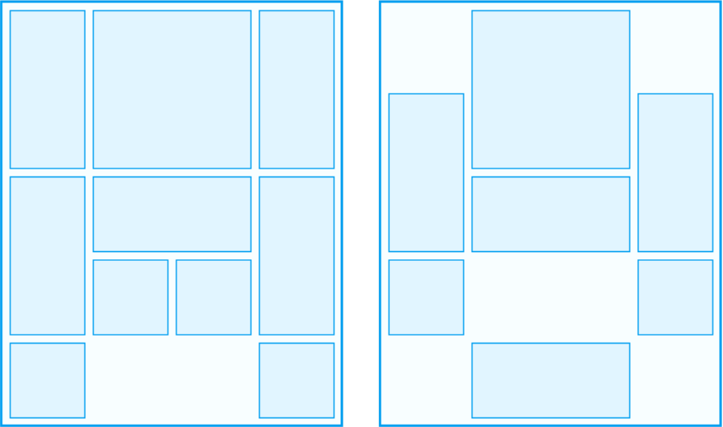

## 华容道布局

### 合法布局定义

+ 棋盘大小为4 x 5

+ 棋子为2 x 2，2 x 1（1 x 2），1 x 1三种

+ 棋子间不能重叠，且至少存在两个空格

+ 有且仅有一个2 x 2块，其他类型不限定

  *（合法的布局必须满足以上四点）*

  合法华容道布局共有29334498种

### 标准情况与非标准情况

标准布局：存在5个2 x 1（或1 x 2）和4个1 x 1棋子的合法华容道布局（363480种）

非标准布局：除标准布局外的全部合法华容道布局（28971018种）

### 合法布局举例：

### 非法布局举例：

**错误原因：**

+ 缺少2 x 2块

+ 仅有一个空格

+ 存在两个2 x 2块

+ 存在3 x 1块

## 棋子移动

+ 移动原则：棋子只能平行移动，不能进行旋转，移动后棋子间不可重叠；

+ **一步**：某一棋子做任意次移动的过程；

+ **子布局**：某一布局通过一步移动得到的布局称为子布局；

+ **相邻布局**：两布局互为对方子布局时，两者为相邻布局；

性质：若布局A是布局B的子布局，则同时必有布局B是布局A的子布局；

### 步的举例

## 群

定义：群是有限个不同布局的集合，该集合中全部布局都可以由其中任一布局经过有限次移动得到；

性质1：群中任意一个布局无论如何移动，其结果仍在该群内；

性质2：只需群中任意一个布局，即可复原出群中的所有元素；

性质3：群是封闭的，群中所有元素无序且互异，同时构成一个关系网；

统计：29334498种布局可拆分出25422个群，其中元素数量存在两极分化现象；

[群的数量统计](./group_num.md)

### 群的种子

定义：群中任意一个布局称为该群的种子；

由上文性质2可知，群中任一布局进过多次移动可复原出整个群，故描述一个群仅需其中一个布局，常取其中编码最小的布局进行记录；

[25422个群的种子](../res/seed.zip)

## 分类

### 布局id

合法布局共有29334498种，将它们从小到大排列，进而得到唯一的id(0 ~ 29334497)；

### 摆列方式分类

**2 x 1 与 1 x 2的数量**

将2 x 1（1 x 2）的数量称为jiang_num；

由于至少存在两个空格，于是有`0 ≤ jiang_num ≤ 7`

可分为七种情况：

| jiang_num | COUNT |
| :-: | :-: |
| 0 |  786228 |
| 1 | 4190464 |
| 2 | 8729454 |
| 3 | 9090662 |
| 4 | 4995328 |
| 5 | 1381224 |
| 6 |  157630 |
| 7 |    3508 |

**1 x 1块的数量**

将1 x 1的数量称为bing_num，结合jiang_num进行分类；

由于至少存在两个空格，于是有`0 ≤ bing_num ≤ (14 - jiang_num * 2)`

据此可分为64种情况：

[64种分类的元素数量](./jiang_bing_count.md)

**2 x 1与1 x 2块的方向**

进而，将2 x 1块的数量称为style_num，则1 x 2块的数量为(jiang_num - style_num)，于是有`0 ≤ style_num ≤ jiang_num`

此时可分出203种情况：

[203种分类的元素数量](./style_count.md)

（注意不存在 *jiang_num-bing_num-style_num = 7-0-0* ，即七竖将的情况）

### 按群继续分类

对于一个特定的 *jiang_num-bing_num-style_num* 分组，可拆分出n个群；将分出的群按元素数量从大到小排列，若存在元素数量相同的群，则取其中的最小元素排序；对这些群进行编号得0 ~ (n - 1) 共n个群，编号记为group_num；

因而对于某一群，存在一个唯一编号  *jiang_num-bing_num-style_num-group_num* ；由于群中的元素个数是确定的，将其中的元素按编码从小到大排列，其中的元素可得唯一编号group_index；

所以，对于任意布局，可得唯一编号 *jiang_num-bing_num-style_num-group_num-group_index*；

[群包含的元素数量统计](./group_size.md)

## 基本参数定义

**最少步数**：布局A和布局B处于同一个群，从布局A移动到B所需最少的步数，该数值存在且是确定的；

性质1：布局A到B的最少步数与布局B到A的最少步数必定相同；

性质2：若两布局不在同一个群中，则最少步数不存在；

**最短路径**：从布局A到布局B，所有满足最少步数的路径；

性质：最短路径在大多数情况下不止一条，且它们之间会相互交错，一般绘制多点层级路线图进行研究；

**最远步数**：布局A到它所在群中任一布局均存在一最少步数n，其中最大的n称为`最远步数`；

性质：标准华容道中不存在最远布局退化的情况，即最远步数至小为1；

**最远布局**：布局A到布局B的最少步数为`最远步数`时，称布局B为布局A的`最远布局`；

性质：最远布局必然存在，且大多数情况下不止一个；

> 下称满足2 x 2方块在棋盘的最下方中间的布局拥有特征S（即2 x 2块所在位置编号为13，亦或编码以D开头）；

**布局无解**：布局A所在群中不存在满足`特征S`的布局；

**解**：布局A所在的群中存在布局T满足`特征S`，且布局A到T的任何最短路径上不存在满足`特征S`的节点，则称布局T为A的一个解；

**最少步解的步数**：若布局存在解，布局A到解的最少步数为n，其中最小的n称为`最少步解的步数`；

**最少步解**：布局A的所有解中满足步数为`最少步解的步数`的布局，称为`最少步解`；

性质1：布局的解可能是空集；

性质2：最少步解属于解的子集，满足`(最少步解的个数) ≤ (解的个数)`；

## 层级关系

### 层模型

表述：存在一起始布局A，从它开始衍生出有限个布局，每个布局抽象为一个节点，同时称A为根节点；由于任一由A衍生出布局到根节点存在一个确定的最少步数，将其称之为到根节点的距离；将所有距离相同的布局称为一个层，层内元素无序且互异，根节点所在层称为第0层，之后依次排列可得有限个层；记排列的最后一层为第n层，则共有n + 1个层(包括第0层)；

性质1：所有层中的元素集合即为根节点所在的群；

性质2：第a层节点的子布局必定在第a - 1层，第a层或第a + 1层，其中a满足`1 ≤ a ≤ (n - 1)`；第0层的子布局必定在第1层；第n层的子布局必定在第n - 1层或第n层；

**层间联系**：若第a + 1层中存在第a层的子布局，则将两者链接起来，其中a满足`0 ≤ a ≤ (n - 1)`；

**向后传播**：在第a层存在一节点K，在第a + 1层取得其子布局K'(0个及以上)，再将每个K'在第a + 2层取得K''(0个及以上)，以此类推得到分层的有限个布局，这个过程称为`向后传播`；

**向前查找**：在第a层存在一节点J，在第a - 1层取得其子布局J'(1个及以上)，再将每个J'在第a - 2层取得J''(1个及以上)，以此类推直到第0层的根节点，查找的数据即为节点J到根节点的全部最短路径合集，这个过程称为`向前查找`；

### 各参数在层模型中的体现

**最少步数**：某一节点所在层数为其到根节点的最少步数；

**最短路径**：对某一节点做`向前查找`，即可得到最短路径的合集；

**最远步数**：若共有n + 1层，则最远步数为n；

**最远布局**：最后一层的全部节点均为最远布局；

> 下方特征S的定义与上文一致，且下列讨论均为根节点有解的情况

**最少步解的步数**：第一次出现满足特征S的节点所在层数；

**最少步解**：在层数为`最少步解的步数`的层中，全部满足特征S的节点；

**解**

定义1：对满足特征S的节点`向前查找`，若得到的结果不存在任何满足特征S的节点，则该节点称为根节点的`解`；

定义2：对全部`最少步解`进行`向后传播`，将得到的结果进行标记；再向后逐层查找，若有满足特征S且未被标记的节点记为`解`，并进行`向后传播`，以此类推直到最后一层；整个过程得到的`解`与`最少步解`的集合称为根节点的`解`；

### 网模型

表述：网模型针对一个群，群中每一个布局称为节点，将每个节点与其子布局节点连接起来，整个群即可连成一个网状模型；

性质1：可在网模型中抽象出层模型及其层间连接；

性质2：层模型的节点等同于网模型，但节点间的连接是网模型的一个子集；

应用：选定网模型中的一个节点，可据此直接构建出该节点对应得层模型；

